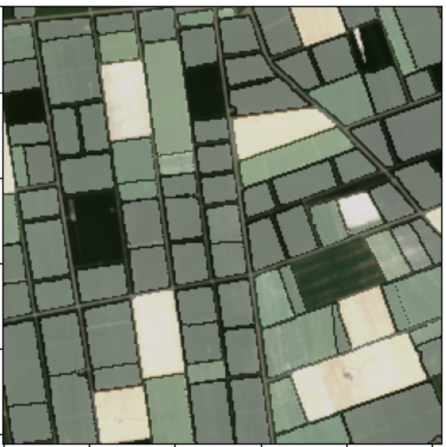
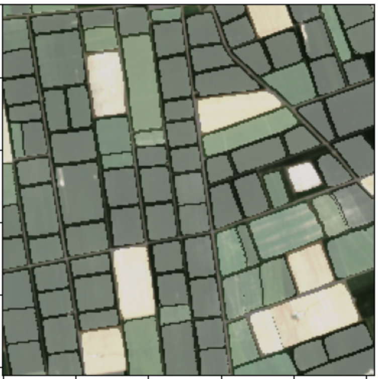

# boundary-sam
Official implementation of improved parcel boundary delineation using SAM image embeddings and detail enhancement filters

## Paper
Read the full method in our IEEE Remote Sensing Letters publication:  
[Boundary SAM: improved parcel boundary delineation using SAM’s image embeddings and detail enhancement filters](https://ieeexplore.ieee.org/document/10972171)

## Visual Comparison

| SAM masks                  | BoundarySAM output          |
|:--------------------------:|:---------------------------:|
|  |  |